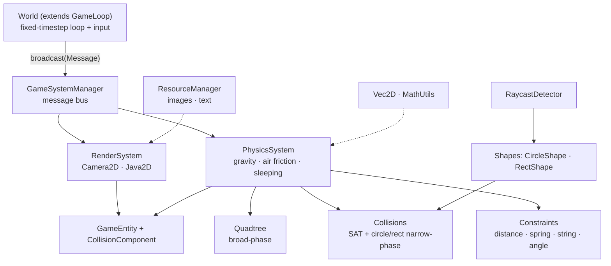

# GameLib

**A 2D game engine for Java — a message-driven entity/component core wrapped around a rigid-body physics and collision engine you can drop into a Swing window.**



GameLib is built around one idea: a fixed-timestep `GameLoop` drives a `World`, and everything else is a `GameSystem` reacting to broadcast `Message`s. Game objects are `GameEntity` bags of components; the bundled `PhysicsSystem` and `RenderSystem` do the heavy lifting — impulse-based collision response, a quadtree broad-phase, joints and constraints, sleeping bodies, and raycasting.

## Features

- **Message-driven ECS** — `GameSystemManager` broadcasts typed `Message`s to registered `GameSystem`s; entities are composable bags of `GameComponent`s, so game logic, physics, and rendering stay decoupled.
- **Fixed-timestep loop** — `GameLoop` decouples update rate (UPS) from draw rate (FPS) with an accumulator, and queues AWT keyboard and mouse input for you.
- **Rigid-body physics** — gravity, air friction, per-`Material` restitution and friction, and sleeping bodies, resolved with impulse-based collision response.
- **Collision detection** — `Quadtree` broad-phase plus a SAT and specialized circle/rect narrow-phase that produces a `CManifold`; circle and AABB raycasting via `RaycastDetector`.
- **Constraints & joints** — distance, spring, string, angle, and point-body constraints, solved over several iterations per frame for stability.
- **Rendering & resources** — a Java2D `RenderSystem` with a pannable `Camera2D`, an immutable `Vec2D` math type, and a caching `ResourceManager` for images and text.

## Usage

```java
import java.awt.*;
import java.awt.event.*;
import java.util.Queue;

import draw.RenderSystem;
import game.World;
import game.entity.GameEntity;
import game.messaging.*;   // CreateEntityMessage, RenderMessage, UpdateMessage
import math.Vec2D;
import physics.*;          // CollisionComponent, Material, PhysicsSystem
import physics.collision.shape.CircleShape;

/** A window where every mouse click drops a bouncing rubber ball. */
public class BouncingBalls extends World {

    public BouncingBalls(Dimension bounds) {
        super(60, 120, bounds); // cap drawing at 60 FPS, step physics at 120 UPS
        systemManager.addSystem(new RenderSystem(systemManager, this));
        systemManager.addSystem(new PhysicsSystem(systemManager,
                new Rectangle(0, 0, bounds.width, bounds.height)));
    }

    private void dropBall(int x, int y) {
        CollisionComponent ball = new CollisionComponent();
        ball.setPos(new Vec2D(x, y));
        ball.setShape(new CircleShape(10));
        ball.setMass(10);
        ball.setMaterial(Material.RUBBER);
        GameEntity entity = new GameEntity();
        entity.addComponent(ball);
        systemManager.broadcast(new CreateEntityMessage(entity)); // physics + render pick it up
    }

    @Override public void update(float dt) { systemManager.broadcast(new UpdateMessage(dt)); }
    @Override public void draw(Graphics2D g) { systemManager.broadcast(new RenderMessage(g)); }

    @Override
    public void processInput(Queue<EventPair<KeyEvent, KeyEventType>> keys,
            Queue<EventPair<MouseEvent, MouseEventType>> mouse, Queue<MouseWheelEvent> wheel) {
        for (EventPair<MouseEvent, MouseEventType> e : mouse)
            if (e.type == MouseEventType.CLICK) dropBall(e.event.getX(), e.event.getY());
    }

    public static void main(String[] args) {
        new BouncingBalls(new Dimension(800, 600)).createFrame().run();
    }
}
```

## Build & run

GameLib is an Eclipse Java 8 project — source in `GameLib/src`, tests in `GameLib/test`, and the SLF4J jars in `GameLib/dependencies`. Import it via *File → Import → Existing Projects into Workspace*, or build from the command line:

```bash
cd GameLib
# compile the library
javac -cp "dependencies/*" -d bin $(find src -name "*.java")
# compile and run the bundled demo: a rope of linked circles; click to drop steel balls
javac -cp "dependencies/*:bin" -d bin test/test/Test.java
java  -cp "bin:dependencies/*:res" test.Test
```

## How it works

The `World` (a `GameLoop`) advances physics in fixed `dt` steps and repaints a Swing `DrawingPanel`, broadcasting an `UpdateMessage` and a `RenderMessage` each frame. Systems subscribe by returning the `Message` classes they accept from `getAcceptedMessages()`. Each tick the `PhysicsSystem` rebuilds its `Quadtree` for broad-phase, runs narrow-phase collision detection plus constraint solving over several iterations, and puts low-energy bodies to sleep so idle stacks stay cheap. Because systems only ever talk through the message bus, you can add your own `GameSystem` without touching the rest of the engine.

Tech: Java 8 · SLF4J · Swing/Java2D. Built as a learning project — not published to a package registry.
